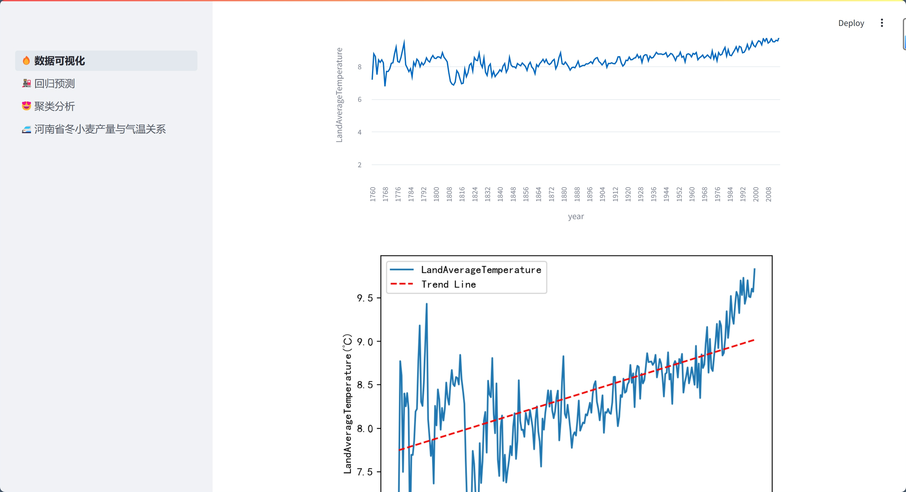
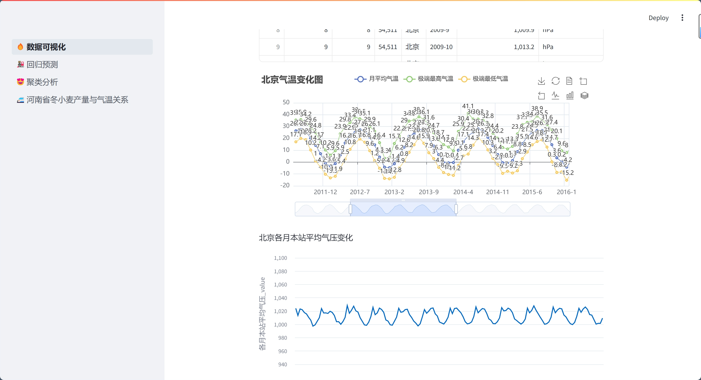
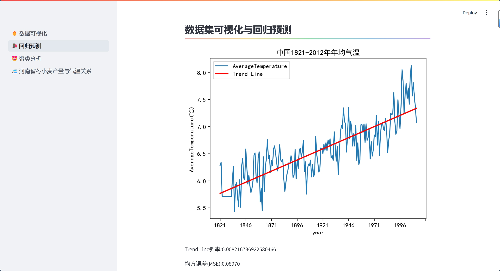
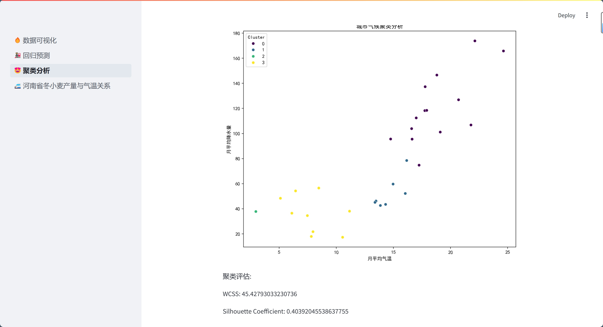
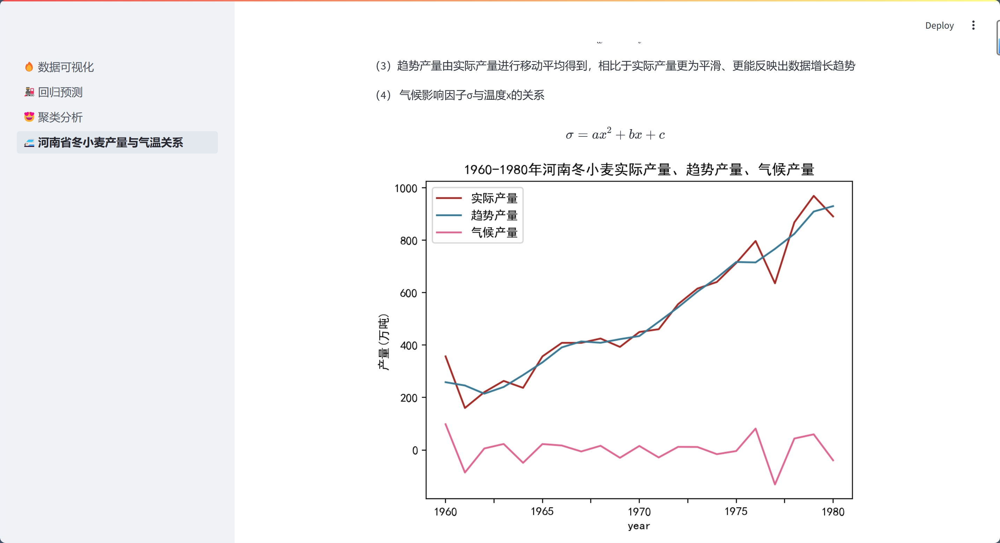
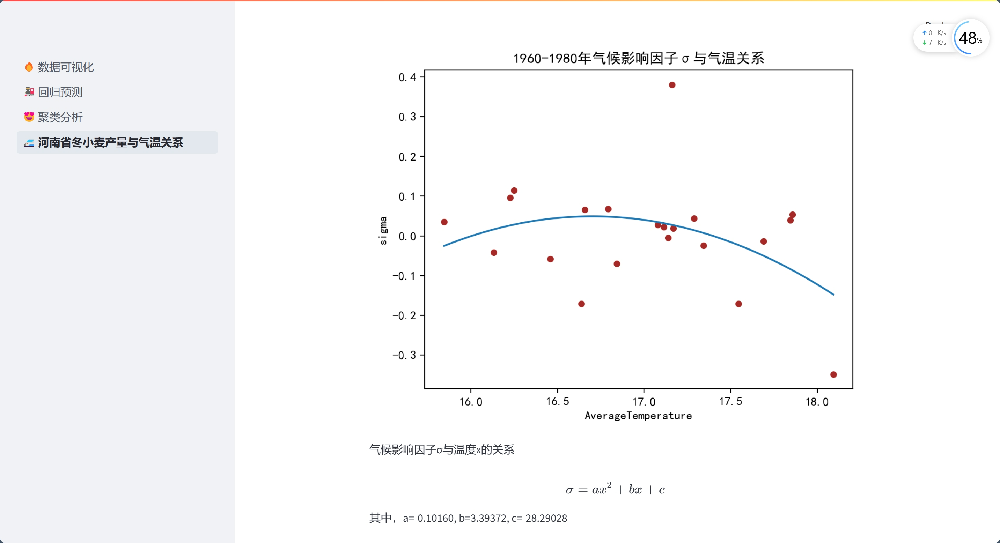
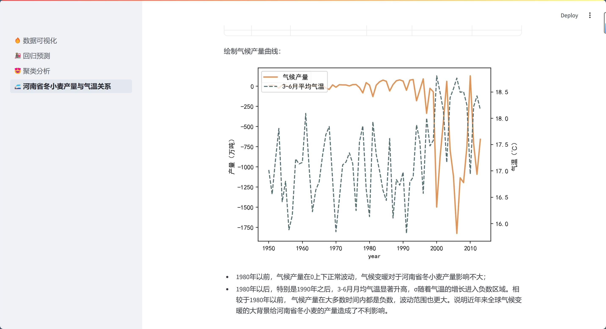

项目采用*Streamlit*搭建的UI来进行交互式可视化以及项目分析展示，以下为工程文件介绍。

### 平台截图
##### 数据可视化
  
 
##### 回归预测

##### 聚类分析

##### 河南省冬小麦产量与春季气温分析

### 文件目录结构
Data_proj/
│
├── GlobalData/##相关原始数据           
│   ├── GlobalLandTemperaturesByCity.csv
│   ├── GlobalLandTemperaturesByCountry.csv
│   ├── GlobalLandTemperaturesByMajorCity.csv
│   ├── GlobalLandTemperaturesByState.csv
│   └── GlobalTemperatures.csv
│
├── 1可视化.py##Streamlit中第1页的文件 
├── 2回归预测.py##Streamlit中第2页的文件 
├── 3聚类分析.py##Streamlit中第3页的文件 
├── 4河南省冬小麦产量与气温.py##Streamlit中第4页的文件 
├── demo.py##Streamlit中的主文件
├── 气象要素合并.xlsx##处理后的相关数据  
├── China.csv##处理后的相关数据  
├── README.md
├── run.bat ##自动运行脚本
└── requirements.txt ##调用的库以及对应版本

### 项目运行方法
- 方法1：
1. **确保python运行虚拟环境中各库的版本与`requirements.txt`一致**
2. 在工程根目录`Data_proj`下打开cmd（或者用vs code打开`Data_proj`文件夹）
3. 在cmd或vscode终端中输入`streamlit run demo.py`将自动运行UI
4. 点击cmd或vscode显示的链接，将在浏览器中渲染UI界面。
- 方法2：
在python运行虚拟环境中各库的版本与`requirements.txt`一致的情况下，点击`run.bat`即可。